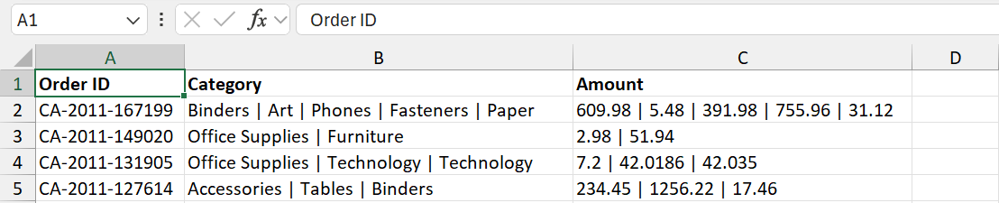
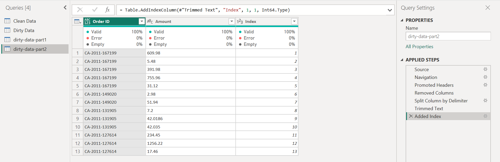
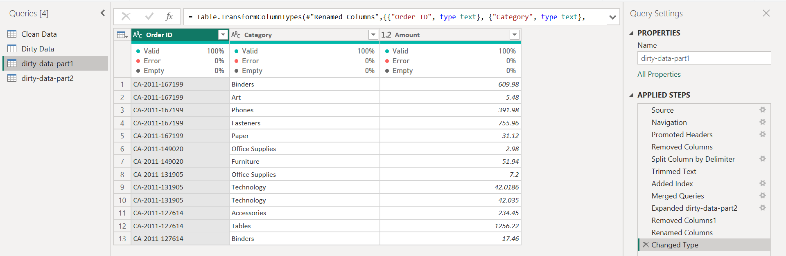
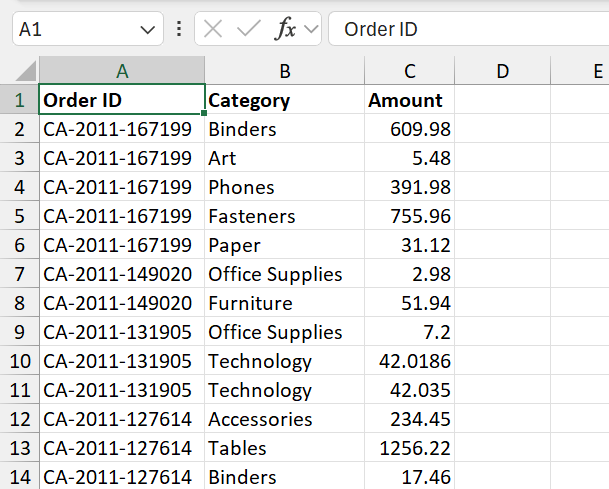

# 📊 Power BI Data Transformation Challenge #4

Transforming merged category and amount data into a clean, structured, and analysis-ready dataset using Power Query in Power BI.

---

## 🔴 Raw Dataset

### Challenge
- Multiple categories stored in a single field
- Multiple amounts stored in a single field
- Data not suitable for analysis
- Required restructuring and normalization

---

## 🔵 Power Query Transformation

### Transformation Steps

### Transformations Applied
- Split Column by Delimiter
- Trim Text
- Added Index Column
- Merged Queries
- Expanded Columns
- Removed Unnecessary Columns
- Renamed Columns
- Changed Data Types

---

## 🟢 Clean Dataset

### Result
- Categories separated correctly
- Amounts aligned with corresponding categories
- Structured tabular format
- Ready for reporting and analysis

---

## 📚 How to Recreate This Transformation

1. Download the Excel file.
2. Open Power BI Desktop.
3. Click **Get Data → Excel Workbook**.
4. Select the dataset and click **Transform Data**.
5. Create **two Duplicate (or Reference) queries** from the original table.

### Query 1 (Category Table)
6. Remove the **Amount** column.
7. Select the **Category** column.
8. Choose **Split Column → By Delimiter**.
9. Under **Advanced Options**, select **Split into Rows**.
10. Add an **Index Column**.

### Query 2 (Amount Table)
11. Remove the **Category** column.
12. Select the **Amount** column.
13. Choose **Split Column → By Delimiter**.
14. Under **Advanced Options**, select **Split into Rows**.
15. Add an **Index Column**.

### Merge Queries
16. Merge both queries using the **Index** column.
17. Expand the merged table.
18. Keep the required columns.
19. Remove unnecessary columns.
20. Rename columns appropriately.
21. Verify and update data types.
22. Click **Close & Apply**.

### Result
A clean and structured dataset where each Category is correctly aligned with its corresponding Amount, ready for reporting and analysis.

---

## 🛠 Tools Used

- Microsoft Excel
- Power BI
- Power Query

---

## 🚀 Outcome

Successfully transformed complex order-level records containing multiple categories and amounts into a structured dataset suitable for business analysis.

---

⭐ If you found this project useful, consider giving the repository a star.
